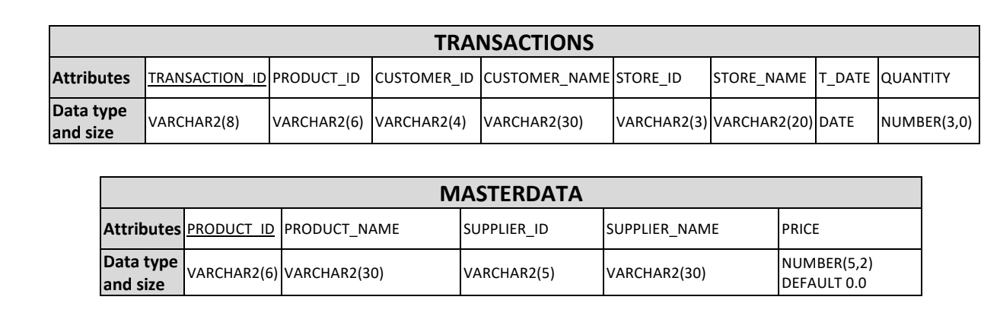
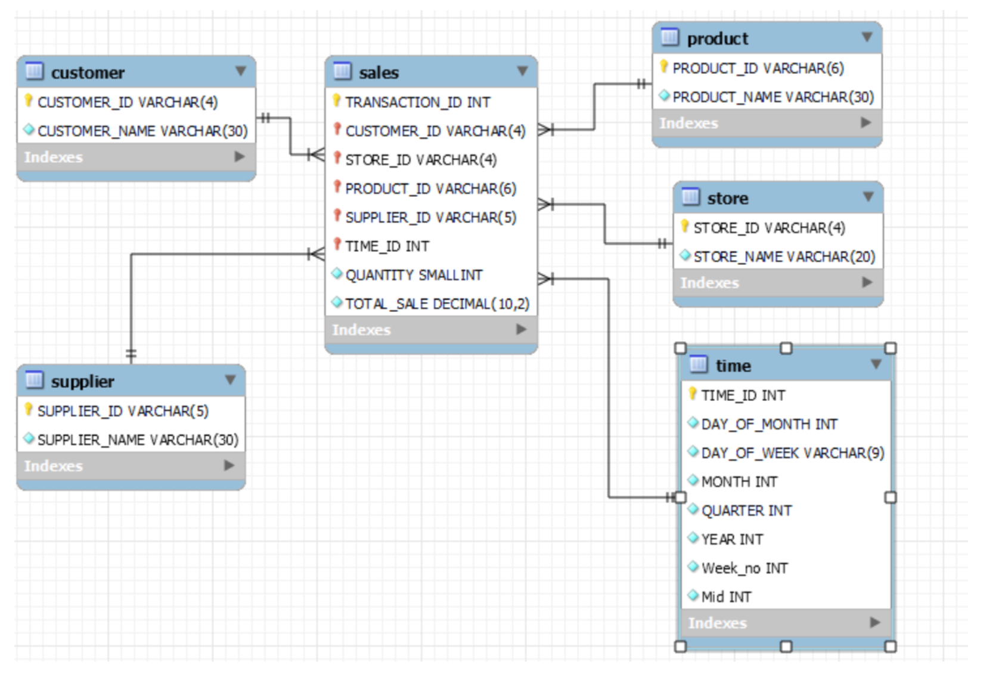
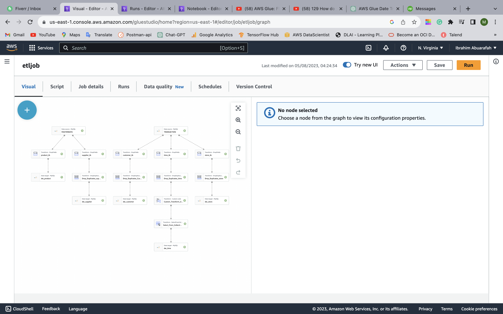

# Datawarehouse-ETL-pipeline-with-AWS-Glue
Building and Analysing Data Warehouse Prototype for METRO Shopping Store in Pakistan

### Introduction

In this project, I build an ETL pipeline that extracts their data from **AWS RDS MySql Database** (data storage), stages tables on **AWS RDS** (data warehouse), and execute **SQL** statements that create the analytics tables from these staging tables.

### Datasets
Datasets used in this project METRO shopping store. One Table contains TRANSACTIONS about sales, the second table Masterdata contain product and supplier record. 

### Database Schema
The Database schema is shown as follows

Two tables 
#### Staging Table 
+ **TRANSACTIONS** - 10,000 records.
+ **Masterdata** - 100 records.

I createa a star schema optimized for queries on sale data analysis. This includes the following tables.

#### Fact Table 
+ **sale** - records in event data associated with song plays i.e. records with page `NextSong`

#### Dimension Tables
+ **customer** - customer info
+ **products** - product info in database
+ **store** - store in  database
+ **time** - timestamps of records
+ **supplier** - supplier of records

The Data warehouse schema is shown as follows

### Data Warehouse Configurations and Setup
* Create a new `IAM user` in your AWS account
* Give it AdministratorAccess and Attach policies
* create  RDS database.
* Create an `IAM Role` that makes `RDS mysql database`.
* create database in AWS glue catlog.
* create connection database in AWS Glue.
* Create crawler in AWS glue.
* Design ETL pipeline 
* create custom transform script.

### AWS Glue ETL Pipeline
+ Automate: Use AWS Glue to automate the ETL process, so that it can be run on a schedule
+ Loading the data from `AWS RDS database` to AWS data catlog database then transform into  `data warehouse`.
+ Data analytics: To perform data analysis 

